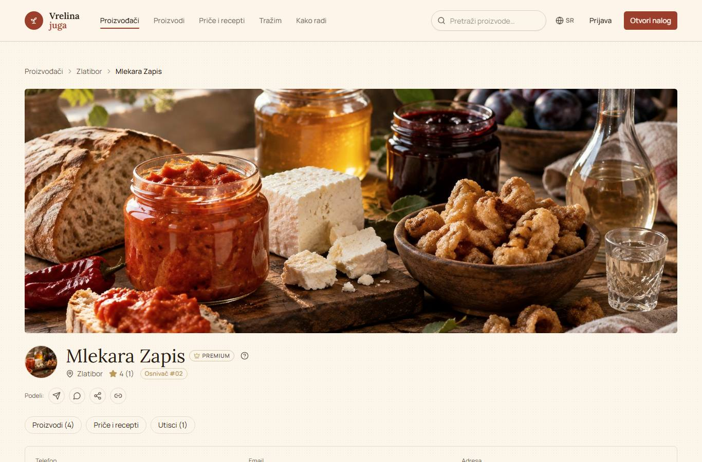
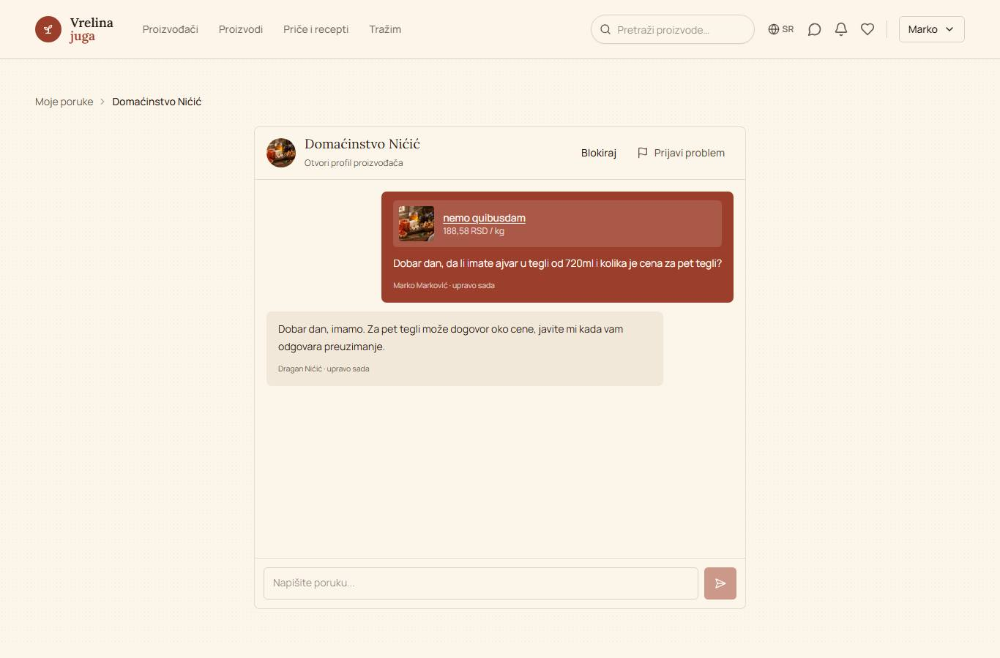
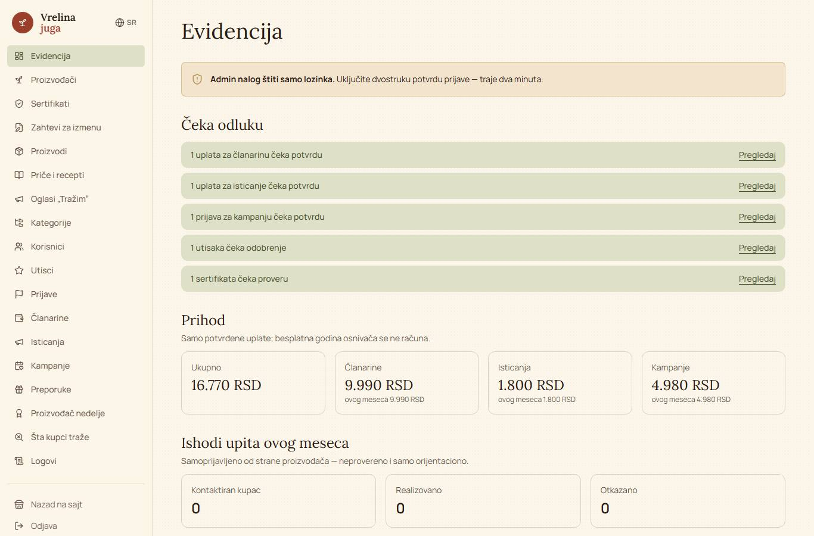
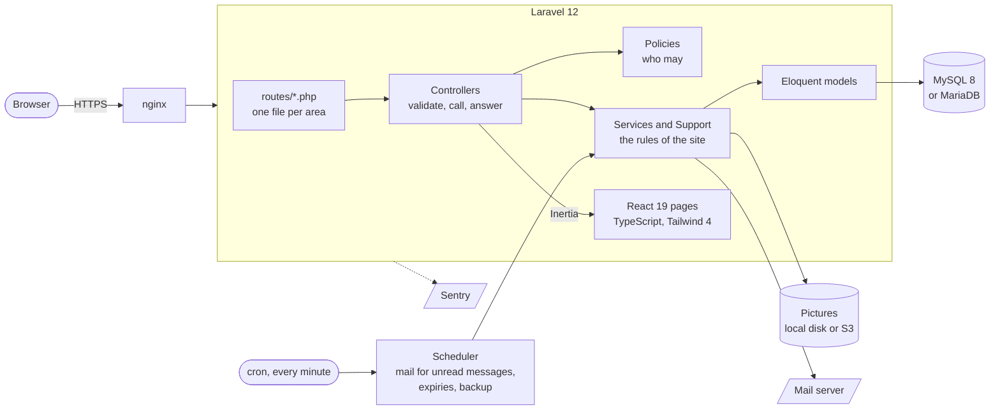

# Vrelina juga

*[Na srpskom](README.sr.md)*

A marketplace for small food producers from the south of Serbia: honey, ajvar, cheese, rakija and
whatever else is made at home. The platform **is not a shop**. There is no cart and no payment on
the site. A buyer finds a product and sends an inquiry; quantity, price and delivery are agreed
between the two of them, in messages on the site.

The platform earns from producers: memberships (Basic, Premium, Pro), paid boosts of a profile or a
product, and seasonal campaigns. All of it is paid by bank slip with an IPS QR code, and an
administrator confirms the payment.

The site has not been launched yet. What is here runs locally and in CI, with demo content.

| | |
| --- | --- |
|  |  |
|  |  |


The texts in the screenshots are demo content, in Serbian; the site also speaks English and Russian.

## Who can do what

| Role | What they can do |
| --- | --- |
| **Visitor** | Search and filter products and producers, category pages, a map and "nearest to me", producers' pages with their markets and certificates, a price catalogue to share, stories and recipes |
| **Buyer** | An account by e-mail or through Google, an inquiry from a product's page and the conversation after it, following producers, saved products, "tell me when it is back", a review of a producer (only once the producer has answered them), reporting a problem |
| **Producer** | Their own page and products (pictures, season, stock), answers to buyers (with saved quick replies) and to reviews, statistics, the markets they sell at, certificates, stories and recipes, a catalogue for Viber, referrals with a reward, a QR poster for the stall, membership, boosts and campaigns |
| **Admin** | Approving producers, checking certificates, moderating reviews, reports, products and stories, confirming payments, prices and plans, the producer of the week, the activity log |

Roles combine: a producer is also a buyer at somebody else's stall.

## How it is built



- **Routes** are split by area in `routes/*.php`: `marketplace.php` for the public pages,
  `messages.php`, `memberships.php`, `admin.php` and so on.
- **Controllers are thin**: validation, a call to a service, an answer. The rules live in
  `app/Services` (memberships, boosts, statistics, response time, payment slips) and `app/Support`
  (search, media, QR codes, slugs).
- **Authorization** goes through the policies in `app/Policies`. A test reads every signed-in route
  from the router and sends a stranger to each one that belongs to somebody
  (`tests/Feature/PrivateRouteInventoryTest.php`).
- **No queue worker.** Side jobs run after the response is sent, and anything periodic runs from
  the scheduler, so the site works on the cheapest server there is. `docs/scaling.md` says what to
  change when that stops being enough.
- **Pictures** go through `App\Support\Media` (upload, small copies, deletion); `MEDIA_DISK` chooses
  between the local disk and S3 or a CDN.
- **Notifications:** a bell on the site for everything; e-mail for unread messages and for what the
  reader asked for.
- **Translations:** the Serbian sentence in the code is the key; `lang/en.json` and `lang/ru.json`
  are the translations, and a test fails when a key is missing from either.

**Stack:** Laravel 12 (PHP 8.2+), MySQL 8 / MariaDB 10.4+ (SQLite in tests), Inertia.js 2,
React 19 with TypeScript, Tailwind CSS 4, Radix UI, Spatie `laravel-permission`, dompdf and
endroid/qr-code (payment slips, the poster), Leaflet with OpenStreetMap, Sentry.

## Running it

With Docker, nothing else needs to be installed (see [docs/docker.md](docs/docker.md)):

```bash
docker compose up -d --build
```

Without Docker, with PHP 8.2, Composer, Node 22 and a database:

```bash
composer install
npm install
cp .env.example .env
php artisan key:generate
php artisan migrate --seed
php artisan storage:link
composer run dev
```

The site is on `http://127.0.0.1:8000`; errors are written to `storage/logs/laravel.log`. In
PowerShell on Windows use `npm.cmd` in place of `npm`, or work in Git Bash.

`php artisan migrate --seed` fills a local database with demo content: producers, products,
conversations, reviews and payments in every state. The demo accounts are `admin@gmail.com` /
`admin` and `marko@example.com` / `password`. In production the same seeder makes only the roles,
the categories and the plans, and the administrator is made with `php artisan admin:create`.

## How it is checked

```bash
php artisan test                       # PHP: feature and unit tests
npm test                               # React components and helpers (Vitest)
npm run build && npm run test:e2e      # in a real browser (Playwright); first: npx playwright install chromium
composer analyse                       # static analysis (Larastan, level 5)
vendor/bin/pint --test                 # PHP code style
npm run lint && npx tsc --noEmit && npm run format:check
```

The browser tests start a site of their own with its own database (`storage/e2e.sqlite`), so they
touch neither your database nor `composer dev`.

On every pull request CI (`.github/workflows`) runs:

| Workflow | What it checks |
| --- | --- |
| `tests` | The PHP suite on SQLite and on MySQL 8, and the browser tests, among them axe on 37 pages in the light and the dark theme |
| `frontend-tests` | The Vitest suite |
| `lint` | Pint, Larastan, Prettier, ESLint, TypeScript |
| `audit` | Known vulnerabilities in the Composer and npm packages |
| `docker` | The Docker stack builds and answers |
| `deployment-safeguards` | The deployment script, against throw-away repositories |
| `coverage` | How much of the services the tests run |

`performance` and `mutation` are run by hand: the first times the main pages against 2,000
producers on MySQL, the second changes the services one thing at a time to see whether a test notices.

## Further reading

| | |
| --- | --- |
| [docs/database.md](docs/database.md) | The database schema |
| [docs/deploy.md](docs/deploy.md) | Putting the site on a server, step by step (in Serbian) |
| [docs/operations.md](docs/operations.md) | Running it once it is live: what runs when, backups, what to do when something is wrong |
| [docs/scaling.md](docs/scaling.md) | What to change as traffic grows |
| [docs/performance.md](docs/performance.md) | The load test, its numbers, and what is left |
| [docs/docker.md](docs/docker.md) | The Docker stack |
| [docs/design-tokens.md](docs/design-tokens.md) | Colours, fonts and spacing (in Serbian) |
