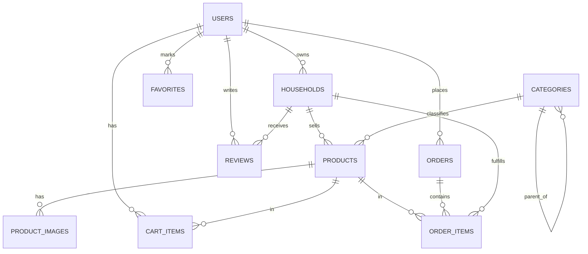

# Dizajn baze podataka

Pregled relacija:

## users (proširenje starter kit tabele)

| Polje | Tip | Opis |
| --- | --- | --- |
| id | bigint PK | |
| name | string | |
| email | string, unique | |
| password | string | |
| phone | string, nullable | |
| avatar_path | string, nullable | |
| address | string, nullable | ulica i broj |
| city | string, nullable | |
| lat / lng | decimal, nullable | za mapu/pretragu po blizini (kasnije) |
| created_at / updated_at | timestamp | |

Rola (buyer/seller/admin) se ne čuva kao kolona nego kroz Spatie `model_has_roles` tabelu - jedan user može imati i buyer i seller rolu istovremeno.

## households (domaćinstva)

| Polje | Tip | Opis |
| --- | --- | --- |
| id | bigint PK | |
| user_id | FK → users | vlasnik domaćinstva |
| name | string | |
| slug | string, unique | za lep URL |
| description | text, nullable | |
| address / city | string, nullable | |
| lat / lng | decimal, nullable | |
| cover_image_path | string, nullable | |
| logo_path | string, nullable | |
| status | enum: pending, active, blocked | default `pending`, admin odobrava |
| created_at / updated_at | timestamp | |

## categories

| Polje | Tip | Opis |
| --- | --- | --- |
| id | bigint PK | |
| parent_id | FK → categories, nullable | za podkategorije |
| name | string | |
| slug | string, unique | |

## products

| Polje | Tip | Opis |
| --- | --- | --- |
| id | bigint PK | |
| household_id | FK → households | ko prodaje |
| category_id | FK → categories | |
| name | string | |
| slug | string, unique | |
| description | text, nullable | |
| price | decimal(10,2) | |
| unit | enum: kg, g, l, ml, kom, paket | jedinica mere |
| stock_quantity | integer | dostupna količina |
| status | enum: draft, active, out_of_stock, archived | |
| created_at / updated_at | timestamp | |

## product_images

| Polje | Tip | Opis |
| --- | --- | --- |
| id | bigint PK | |
| product_id | FK → products | |
| path | string | |
| order | integer | redosled prikaza, 0 = glavna slika |

## cart_items (korpa)

| Polje | Tip | Opis |
| --- | --- | --- |
| id | bigint PK | |
| user_id | FK → users | |
| product_id | FK → products | |
| quantity | integer | |
| created_at / updated_at | timestamp | |

Unique(`user_id`, `product_id`) - nema posebne `carts` tabele, korpa je prosto svi `cart_items` tog usera (jednostavnije za MVP).

## orders (porudžbine)

| Polje | Tip | Opis |
| --- | --- | --- |
| id | bigint PK | |
| user_id | FK → users | kupac |
| status | enum: pending, confirmed, shipped, delivered, cancelled | |
| total_price | decimal(10,2) | |
| shipping_address | string | snapshot adrese u trenutku porudžbine |
| created_at / updated_at | timestamp | |

## order_items (stavke porudžbine - centralna tabela koja povezuje user i proizvod, preko `orders`)

| Polje | Tip | Opis |
| --- | --- | --- |
| id | bigint PK | |
| order_id | FK → orders | |
| product_id | FK → products, nullable | nullable jer proizvod može kasnije biti obrisan |
| household_id | FK → households | ko ispunjava stavku (denormalizovano radi lakših upita "porudžbine mog domaćinstva") |
| product_name | string | snapshot naziva u trenutku porudžbine |
| unit_price | decimal(10,2) | snapshot cene u trenutku porudžbine |
| quantity | integer | |
| subtotal | decimal(10,2) | |

Snapshot polja (`product_name`, `unit_price`) garantuju da izmena cene proizvoda kasnije ne menja istoriju starih porudžbina.

## reviews (ocene domaćinstava)

| Polje | Tip | Opis |
| --- | --- | --- |
| id | bigint PK | |
| user_id | FK → users | ko ocenjuje |
| household_id | FK → households | ko se ocenjuje |
| rating | tinyint (1-5) | |
| comment | text, nullable | |
| created_at / updated_at | timestamp | |

Unique(`user_id`, `household_id`) - jedan user, jedna ocena po domaćinstvu.

## favorites (omiljeni proizvođač / omiljeni proizvod - polimorfna tabela)

| Polje | Tip | Opis |
| --- | --- | --- |
| id | bigint PK | |
| user_id | FK → users | |
| favoritable_id | bigint | id domaćinstva ili proizvoda |
| favoritable_type | string | `App\Models\Household` ili `App\Models\Product` |
| created_at | timestamp | |

Unique(`user_id`, `favoritable_id`, `favoritable_type`) - jedna tabela pokriva i "omiljeni proizvođač" i "omiljeni proizvod", umesto dve odvojene tabele.

## role tabele (Spatie, generišu se automatski)

`roles`, `permissions`, `model_has_roles`, `model_has_permissions`, `role_has_permissions` - ne dirati ručno, upravljati preko Spatie API-ja.
